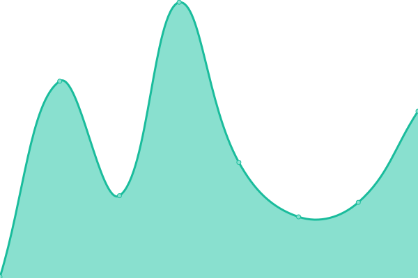
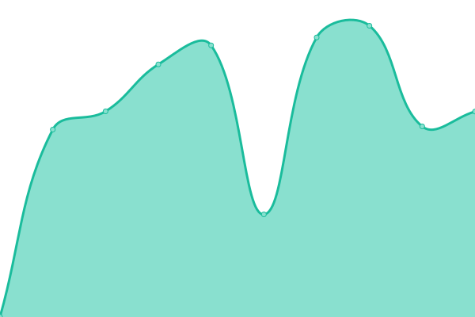
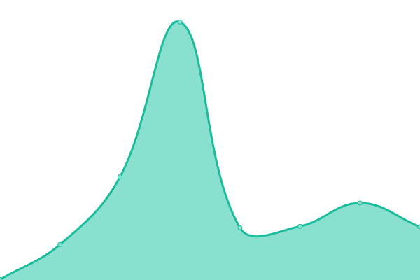

# [📈 Live Status](https://diegosteiner.github.io/heimv-monitor): <!--live status--> **🟧 Partial outage**

This repository contains the open-source uptime monitor and status page for [Diego Steiner](https://diegosteiner.github.io/cv/), powered by [Upptime](https://github.com/upptime/upptime).

With [Upptime](https://upptime.js.org), you can get your own unlimited and free uptime monitor and status page, powered entirely by a GitHub repository. We use [Issues](https://github.com/diegosteiner/heimv-monitor/issues) as incident reports, [Actions](https://github.com/diegosteiner/heimv-monitor/actions) as uptime monitors, and [Pages](https://diegosteiner.github.io/heimv-monitor) for the status page.

<!--start: status pages-->
<!-- This summary is generated by Upptime (https://github.com/upptime/upptime) -->
<!-- Do not edit this manually, your changes will be overwritten -->
<!-- prettier-ignore -->
| URL | Status | History | Response Time | Uptime |
| --- | ------ | ------- | ------------- | ------ |
|  [heimv-main](https://app.heimv.ch/stiftung-pfadiheime/) | 🟩 Up | [heimv-main.yml](https://github.com/diegosteiner/heimv-monitor/commits/HEAD/history/heimv-main.yml) | 

 932ms
     
 | 

<a href="https://diegosteiner.github.io/heimv-monitor/history/heimv-main">100.00%</a>
    

|  [heimv-stgeorg](https://heimv.pfadi-heime.ch/) | 🟩 Up | [heimv-stgeorg.yml](https://github.com/diegosteiner/heimv-monitor/commits/HEAD/history/heimv-stgeorg.yml) | 

 834ms
     
 | 

<a href="https://diegosteiner.github.io/heimv-monitor/history/heimv-stgeorg">100.00%</a>
    

|  [heimv-demo](https://demo.heimv.ch) | 🟥 Down | [heimv-demo.yml](https://github.com/diegosteiner/heimv-monitor/commits/HEAD/history/heimv-demo.yml) | 

 616ms
     
 | 

<a href="https://diegosteiner.github.io/heimv-monitor/history/heimv-demo">100.00%</a>
    

<!--end: status pages-->

[**Visit our status website →**](https://diegosteiner.github.io/heimv-monitor)

## 📄 License

- Powered by: [Upptime](https://github.com/upptime/upptime)
- Code: [MIT](./LICENSE) © [Diego Steiner](https://diegosteiner.github.io/cv/)
- Data in the `./history` directory: [Open Database License](https://opendatacommons.org/licenses/odbl/1-0/)
